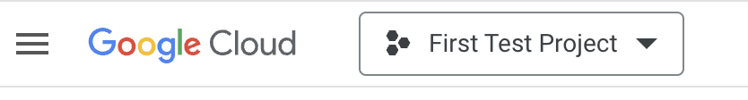
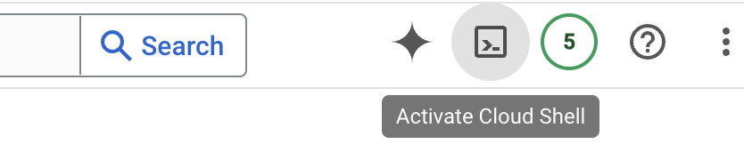
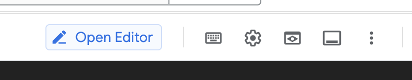
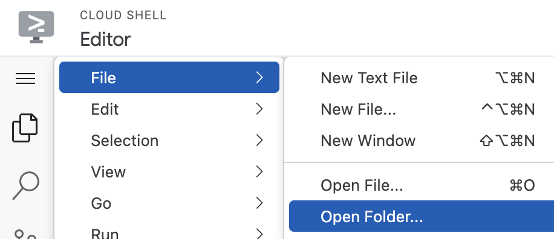
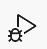
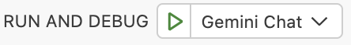
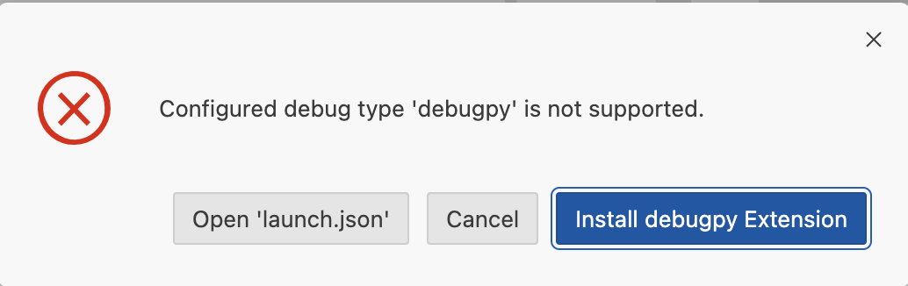
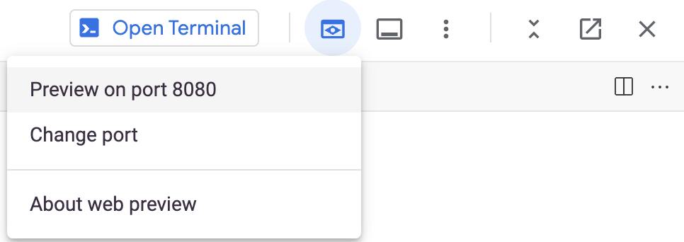
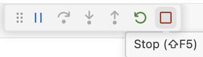

# Welcome to the DB Hackathon Chatbot

> **Credit:** this tutorial and application was developed by Hans-Christian Fuchs (hcfuchs@google.com) of Google Cloud PSO specifically for the DB Hackathon 2024.

The DB Hackathon Chatbot is a starter package which will install a fully working chatbot in your project. You can use it as a base to quickly get started and learn how to do some common things with Vertex AI Gemini.
## Technology
The chatbot is a simple streamlit application. Find documentation about the streamlit framework [here](https://streamlit.io/docs).

It presents you with a chat window and allows you to chat with Gemini, either asking questions about alphabet, the Google Parent Company, or general questions. It will detect when you ask about "alphabet" and ground the answers against the annual report 2023 of alphabet (RAG). In other cases, Gemini will simply draw on its own knowledge.
## Getting started
### Step 1 - Clone Repository
Open [Google Cloud Console](https://console.cloud.google.com) and select your project if it is not already selected.

You now want to activate your cloud shell (takes a moment to deploy and start up, there might be some confirmation required).

When your Cloud Shell is up and running, you are ready to clone this repository to your shell: `git clone url` where the `url` is replaced by the (HTTPS) url you can find under the `clone` button of this repository.

### Step 2 - Set things up

Once you have successfully cloned the repository, you will have a directory `DBHackbot`.

Move into this directory (`cd DBHackbot`).

Start the setup script with `source set_it_up.sh`. This script will create the necessary Google Cloud resources to be able to search and summarize in documents. It also checks if all necessary APIs are enabled. When you run the script for the first time you might be asked to authorize your Cloud Shell - please do so. The script will run for a while and inform you about progress. The document import step could take quite a while when it runs for the first time.

**Note:** The script will ask you for a path to the documents to import. If you have been given a Google Cloud bucket name, enter it in the format `gs://<bucket-name>`. Alternatively you can enter the directory name `sampledoc` where we have prepared the Alphabet Annual Report 2023 for you. You can, of course, use any directory with pdf files for import (*.pdf).

You can re-run this script as often as needed. It won't modify the already existing resources and only reload the documents based on what you enter for the import path.

### Step 3 - Run your application

You can run the application directly from Cloud Shell. Open the Web Editor.

In the Web Editor (it is VSCode) navigate to the file menu and select "open folder".

Navigate to the DBHackbot directory, select it and hit the ok button. If you omit this step, your application won't work.

You are now ready to start the application: Click the Run&Debug icon  and hit the green go button next to "Gemini Chat" .

You might receive a message that "debugpy" is not supported and has to be installed.

Go ahead and hit the install button. You will see a list of extensions on the left with the python debugger at the top. Hit the install button there. When it is finished installing, go back to Run&Debug and try again.

When you see the message ***You can now view your Streamlit app in your browser***, the application is running and ready to test.

### Step 4 - Test your application

Hit the web view button and select "Preview on port 8080".

A new browser tab will open.

**Note:** You may see an error message "Unable to find your project". In this case, go back to the Web Editor tab, hit the red stop square

and in the terminal window below enter `gcloud config set project <your project id>`. After this step you can start the application again and return to the preview browser tab (hit refresh).

Initially the application may take quite a while to start. The application will ask for a password which by default is `pass`. **Hint:** look into `.vscode/launch.json`.

You can now start chatting with Gemini. If you get stuck in the session just refresh the window and the session restarts.

HAVE FUN!

## The application code
Everyting starts in `main.py`. The most important function is `handle_query()`. It detects your intent (Alphabet or something else) and then makes the appropriate Gemini calls. The other code in `main.py` is mainly to provide the streamlit experience. If you want to disable the password check, you can comment it out.

You will want to take a look at `util/rag.py`. This is where we call Gemini with grounding. That happens in `search_engine_grounding()`. There is also a second function, `search_engine_summary()` which you could also call instead from `handle_query()`. The difference is, this function calls Vertex AI Search directly, not as a Tool of Gemini. It returns more detail about the citations. Go ahead and experiment with it.

